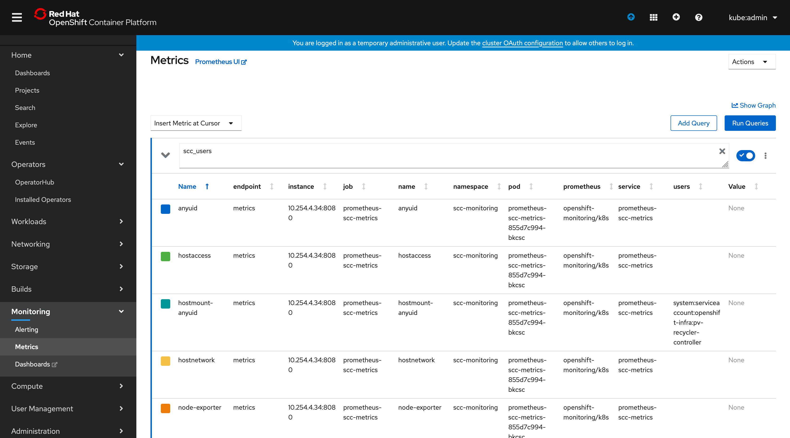
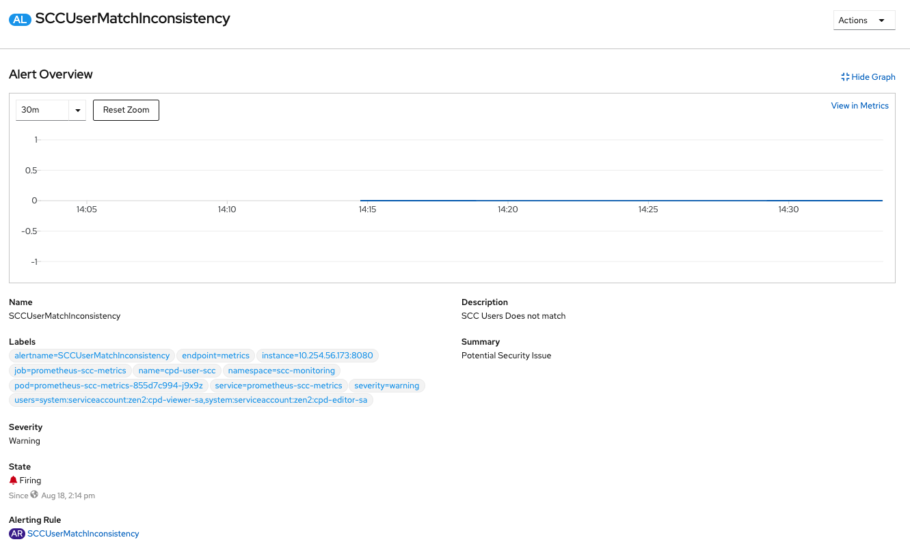

# SCC_Monitoring

A sample implementation that creates a custom Prometheus metric, to keep track of all the Service Account(SA)s that are bound to the Security Context Constraint(SCC)s and triggers an alert for any mismatch.

# Introduction

OpenShift Container Platform ships with a [pre-configured and self-updating monitoring stack](https://docs.openshift.com/container-platform/4.3/monitoring/cluster_monitoring/about-cluster-monitoring.html) that is based on the [Prometheus](https://prometheus.io/) open source project and its wider eco-system. It provides monitoring of cluster components and ships with a set of alerts to immediately notify the cluster administrator about any occurring problems and a set of Grafana dashboards.

However most of the default metrics defined in Prometheus is around Performance monitoring. If we want to monitor the cluster for security state using Prometheus, there are not many metrics that could be useful. So in this sample, we demonstrate how we can monitor the security stance of an OpenShift cluster using Prometheus, by creating a custom Prometheus metric.

# Prometheus SCC Metric

This sample implementation, creates a custom Prometheus metric, to keep track of all the Service Account(SA)s that are bound to the Security Context Constraint(SCC)s. It provides a way to specify which SAs are allowed to be bound to a given SCC. It creates an alert, if a new SA is bound to the SCC which implies that the SCC context is used in projects for which it is not permitted to. It also creates an alert when a new SCC is created. This gives the cluster administrator a chance to look at the security state and take actions as appropriate.

## Deployment Steps

### Create Docker Image

1. `docker build . -t prometheus-scc-metrics:v1.0.0`

    ```text
    Successfully built e8babc5b30e8
    Successfully tagged prometheus-scc-metrics:v1.0.0
    ```

2. `docker save prometheus-scc-metrics:v1.0.0 > prometheus-scc-metrics.tar`

### Add Image to Cluster's Local Image Registry

1. Copy `prometheus-scc-metrics.tar` to cluster
2. `oc login`
3. Create OS Project: `oc new-project scc-monitoring`
4. `podman load < prometheus-scc-metrics.tar`

    ```text
    Getting image source signatures
    Copying blob 50644c29ef5a skipped: already exists
    Copying blob dee768bb77ff skipped: already exists
    Copying blob 5b6857b0792a done
    Copying config e8babc5b30 done
    Writing manifest to image destination
    Storing signatures
    Loaded image(s): localhost/prometheus-scc-metrics:v1.0.0
    ```

5. `podman login -u kubeadmin -p $(oc whoami -t) --tls-verify=false $(oc get route default-route -n openshift-image-registry --template='{{ .spec.host }}')`

    ```text
    Login Succeeded!
    ```

6. Retrieve Image ID via `podman images`

    ```text
    REPOSITORY      TAG      IMAGE ID       CREATED         SIZE
    localhost/prometheus-scc-metrics   v1.0.0   e8babc5b30e8   7 minutes ago   31.5 MB
    ```

7. `podman tag e8babc5b30e8 $(oc get route default-route -n openshift-image-registry --template='{{ .spec.host }}')/scc-monitoring/prometheus-scc-metrics:v1.0.0`

8. `podman push --tls-verify=false $(oc get route default-route -n openshift-image-registry --template='{{ .spec.host }}')/scc-monitoring/prometheus-scc-metrics:v1.0.0`

    ```text
    Getting image source signatures
    Copying blob 50644c29ef5a skipped: already exists
    Copying blob 5b6857b0792a skipped: already exists
    Copying blob dee768bb77ff skipped: already exists
    Copying config e8babc5b30 done
    Writing manifest to image destination
    Storing signatures
    ```

### Creating Kubernetes Objects

1. `cd manifests`
2. `oc login`
3. `oc project scc-monitoring`
4. `oc create -f cluster-role-binding.yaml`
5. `oc create -f service-account.yaml`
6. `oc policy add-role-to-user view "system:serviceaccount:openshift-monitoring:prometheus-k8s" -n scc-monitoring`
7. `oc create -f configmap.yaml`
8. `oc create -f deployment.yaml`
9. `oc create -f service.yaml`
10. `oc create -f service-monitor.yaml`
11. `oc create -f prometheus-rule.yaml`

## Prometheus Metrics

**Exposed Metric:**



## Alerting

`manifests/prometheus-rule.yaml` declares the Alert that will get triggered.

if any `scc_users` metric returns a value of 0 for 1 minute, this warning alert will get triggered.


